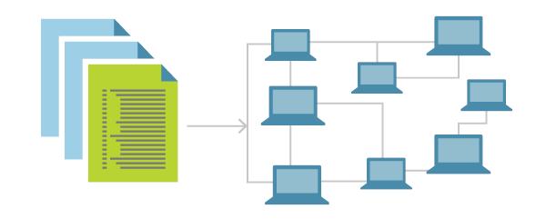

#  | Automation

This page contains all resources about all topics around Automation, Coding, DevOps and Infrastucture as Code.
You will find resources like general recommendations, detailed coding templates and learning pages in these topics.

## Contents
- [Common Resources](#common-resource)
- [Azure DevOps](#azure-devops)
- [Templates](#templates)
- [Articles & Guides](#articles-&-guides) 
- [Sessions](#sessions)
- [Books](#books)

-------------------------------------------------------------------------------------------------------------------
   

## **Common Resources**

|    Title/Link                 | Description                   | Author            | Validated |
| :---------------------------- | ----------------------------- | ----------------- | :----------:|
|[Build5Nines - DevOps](https://build5nines.com/category/devops/)        | Great list of DevOps related articles                           | Chris Pietschmann | |
|[Awesome PowerShell Repo](https://github.com/janikvonrotz/awesome-powershell) | A curated list of delightful PowerShell packages and resources. | Janik Vonrotz     | |

-------------------------------------------------------------------------------------------------------------------
   

## **Azure DevOps**
|  Title/Link                         | Description                          | Author | Validated|
|------------------------------------ | ----------------------------------- | ------- |:----------:|
|[Azure DevOps Feature Timeline](https://docs.microsoft.com/en-us/azure/devops/release-notes/features-timeline) | Roadmap for Azure DevOps             | MSFT   | |
|[Azure DevOps Release Notes](https://docs.microsoft.com/en-us/azure/devops/release-notes/)           | Azure DevOps Release Notes described | MSFT   | |

-------------------------------------------------------------------------------------------------------------------
   

## **Templates**
| Title/Link | Description | Author |Validated |
| :--------: | :---------- | ------ |:------: |

-------------------------------------------------------------------------------------------------------------------
   

## **Articles & Guides**
| Title/Link | Description | Author |Validated |
| :--------: | :---------- | :----- | :------: |

-------------------------------------------------------------------------------------------------------------------
   

## **Sessions**
|Title/Link                  | Description                              | Author                   | Validated |
| -------------------------- | :--------------------------------------- | :----------------------- |:-----------:|
| [Deploying your Azure Infrastructure with Terraform](https://channel9.msdn.com/Shows/DevOps-Lab/Deploying-your-Azure-Infrastructure-with-Terraform) | How to use Terraform to deploy to Azure. | Abel Wang, April Edwards | |

-------------------------------------------------------------------------------------------------------------------
   

## **Books**
| Title/Link | Description | Author |Validated |
| :--------: | :---------- | :----- |----------|

-------------------------------------------------------------------------------------------------------------------
   
___
 <a href="#top" title="Back to the top.">↑Top</a>