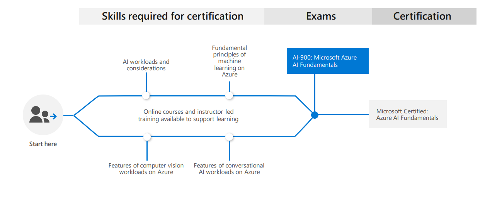

#  | Exam AI-900: Microsoft Azure AI Fundamentals (beta)

|                                   |               |
| :-------------------------------: | :-------- |
|        **Official Link:**         | [Overview AI-900](https://docs.microsoft.com/en-us/learn/certifications/exams/ai-900)                                       |
| **Part of the requirements for:** | [Microsoft Certified: Azure AI Fundamentals](https://docs.microsoft.com/en-us/learn/certifications/azure-ai-fundamentals)   |
|           **Outline:**            | [Outline AI-900](https://query.prod.cms.rt.microsoft.com/cms/api/am/binary/RE4wGpB)                                         |
|            **Length:**            | 100 minutes (during beta?)                                           |
|       **Registration fee:**       | $99 (plus tax where applicable). Other discounts possible.                                                                  |
|         **Exam format:**          | Various question types, taken in person at a test center or from home.                                                      |
|          **Difficulty:**           | N/A                                                 |
|    **Official Practice Test:**    | Not yet available                                   |
| **Certification Learning Path:**  | Not yet available                                   |

-------------------------------------------------------------------
   

## Note
The new Azure Data Fundamentals and Azure AI Fundamentals Certifications were [announced](https://www.microsoft.com/en-us/learning/community-blog-post.aspx?BlogId=8&Id=375310) at the Microsoft Build 2020 Event.
___

-------------------------------------------------------------------
   

## Contents
- [Posts & Guides](#posts--guides)
- [Labs](#labs)
- [Books](#books)
- [Videos / Sessions](#videos--sessions)
- [Online Trainings](#online-trainings)
- [Practice Exams / Tests](#practice-exams--tests)

-------------------------------------------------------------------
   

## **Posts & Guides**
| Published | Title/Link                                                      | Author                                             |
| :-------: | :-------------------------------------------------------------- | :------------------------------------------------- |

-------------------------------------------------------------------
   

## **Labs**
| Title/Link | Description          | Author |
| :--------: | :------------------- | :----- |

-------------------------------------------------------------------
   

## **Books**
| Published | Title/Link  | Author  |
| :-------: | :---------: | :-----: |

-------------------------------------------------------------------
   

## **Videos / Sessions**
| Published | Title/Link                                                   | Author         |
| :-------: | :------------------------------------------------------: | :------------- |

-------------------------------------------------------------------
   

## **Online Trainings**
|    Site     | Title/Link                                                                  | Instructor     |
| :---------: | :---------------------------------------------------------------------- | :------------- |

 -------------------------------------------------------------------
   

## **Practice Exams / Tests**
|Title/Link    | Description                                                             | Author            |
| :----------- | ----------------------------------------------------------------------- | :---------------- |

 -------------------------------------------------------------------
   

 <a href="#top" title="Back to the top.">↑Top</a>
