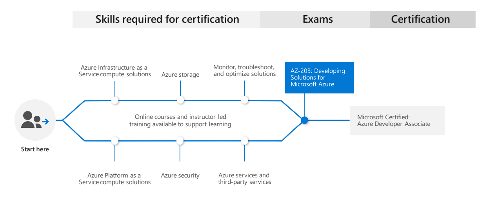

#  | Exam AZ-204: Developing Solutions for Microsoft Azure (beta)

|                                   |                                    |
| --------------------------------- | ---------------------------------- |
| **Official Link:**                | [Overview AZ-204](https://docs.microsoft.com/en-us/learn/certifications/exams/AZ-204)                                   |
| **Part of the requirements for:** | [Microsoft Certified: Azure Developer Associate](https://docs.microsoft.com/en-us/learn/certifications/azure-developer) |
| **Outline:**                      | [Outline AZ-204](https://query.prod.cms.rt.microsoft.com/cms/api/am/binary/RE4oZ7B)                                     |
| **Length:**                       | 3 hours                                                                                                                 |
| **Registration fee:**             | $165 (plus tax where applicable).  Other discounts possible.                                                            |
| **Exam format:**                  | Various question types, taken in person at a test center or from home.                                                  |
| **Difficulty:**                   | N/A                                                                                                                     |
| **Official Practice Test:**       | N/A                                                                                                                     |
| **Certification Learning Path:**  | [Learning path for Azure Developer](https://query.prod.cms.rt.microsoft.com/cms/api/am/binary/RWtQqM)                   |

-----------------------------------------------------------------------------------------
   

## **Contents**
- [Posts & Guides](#posts-&-guides)
- [Labs](#labs)
- [Books](#books)
- [Videos / Sessions](#videos-/-sessions)
- [Online Trainings](#online-trainings)
- [Practice Exams / Tests](#practice-exams-/-tests)

-----------------------------------------------------------------------------------------
   

## **Posts & Guides**
| Published | Title/Link                  | Author            |Checked|
|-----------|---------------------------- | :---------------- |:-------:|
| Mar 2020  | [AZ-204 Developing Solutions for Microsoft Azure Certification Exam Study Guide](https://www.thomasmaurer.ch/2020/03/az-204-study-guide-developing-solutions-for-microsoft-azure/) | Thomas Maurer     | |
| Dec 2019  | [Exam AZ-204 (AZ-203): Developing Solutions for Microsoft Azure. Best resources on the web in 2020.](https://medium.com/@the.green.man/exam-az-203-developing-solutions-for-microsoft-azure-best-resources-on-the-web-in-2020-23c10679b0d2) | Alberto De Natale | |

-----------------------------------------------------------------------------------------
   

## **Labs**
|Title/Link                 | Description                         | Author           |Checked|
| ------------------------- | :-----------------------------------|----------------- |:-------:|
|[AZ-204 Labs](https://github.com/MicrosoftLearning/AZ-204-DevelopingSolutionsforMicrosoftAzure) | Official Microsoft AZ-204 Labs Repo | MSFT   | |
|[AZ-203: Developing Solutions for Microsoft Azure](https://github.com/AzureMentor/AZ-203-DevelopingSolutionsforMicrosoftAzure) | Various labs hosted on Azure Mentor | [Azure Mentor](https://azurementor.wordpress.com/) | |

-----------------------------------------------------------------------------------------
   

## **Books**
| Published | Title/Link | Author |Checked|
| :-------: | :--------- | :----- |:-------:|

-----------------------------------------------------------------------------------------
   

## **Videos / Sessions**
| Published | Title/Link          | Author        |Checked|
| :-------: | ------------------- | :------------ |:-------:|
| Jan 2020  | [Azure Cert CHANGES!! - AZ-104 / AZ-204](https://www.youtube.com/watch?v=Zuxr0rvVgLU)                                                               | Data Knox     | |
| Mar 2020  | [AZ-204 / AZ-203 Developing Solutions For Microsoft Azure - Implement solutions with virtual machines](https://www.youtube.com/watch?v=Wjn6hvZPGDY) | Nitesh Sharma | |

-----------------------------------------------------------------------------------------
   

## **Online Trainings**
| Site  | Title/Link | Instructor |Checked|
| :---: | :--------- | :--------- |:-------:|

-----------------------------------------------------------------------------------------
   

## **Practice Exams / Tests**
|Title/Link   | Description            | Author            |Checked|
| :---------- | ---------------------- | :---------------- |:-----:|
| [Excel Exam Assessment - AZ-203](https://github.com/Build5Nines/exam-assessments/blob/master/Assessments/Exam-Msft-AZ-203-Self-Assessment-Build5Nines.xlsx?raw=1) | Free Azure Certification Exam Self Assessment from Build5Nines.com  - [Guide here](https://build5nines.com/free-oss-exam-self-assessment-tool/) | Chris Pietschmann | |

-----------------------------------------------------------------------------------------
   

___
 <a href="#top" title="Back to the top.">↑Top</a>
