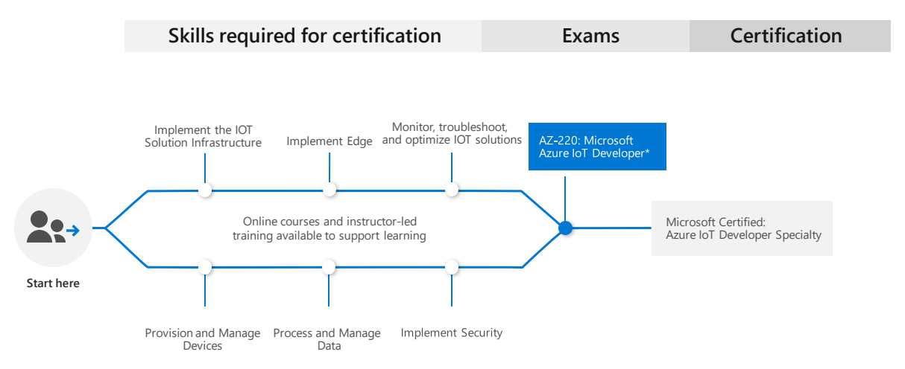

#  | Exam AZ-220: Microsoft Azure IoT Developer (beta)

|                                   | |
|------------------------------- | --------------------------------------------------------- |
|        **Official Link:**         | [Overview AZ-220](https://docs.microsoft.com/en-us/learn/certifications/exams/AZ-220)                                                     |
| **Part of the requirements for:** | [Microsoft Certified: Azure IoT Developer Specialty](https://docs.microsoft.com/en-us/learn/certifications/azure-iot-developer-specialty) |
|           **Outline:**            | [Outline AZ-220](https://query.prod.cms.rt.microsoft.com/cms/api/am/binary/RE4nBeC)                                                       |
|            **Length:**            | 3 hours                                                              |
|       **Registration fee:**       | $165 (plus tax where applicable).  Other discounts possible.         |
|         **Exam format:**          | Various question types, taken in person at a test center or from home.                                                                    |
|          **Difficulty:**          | N/A                                                                  |
|    **Official Practice Test:**    | N/A                                                                  |
| **Certification Learning Path:**  | N/A                                                                  |

--------------------------------------------------------------------------------------
   

## **Contents**
- [Posts & Guides](#posts-&-guides)
- [Labs](#labs)
- [Books](#books)
- [Videos / Sessions](#videos-/-sessions)
- [Online Trainings](#online-trainings)
- [Practice Exams / Tests](#practice-exams-/-tests)

--------------------------------------------------------------------------------------
   

## **Posts & Guides**
| Published | Title/Link     | Author                                             |
| :-------: | -------------- | :------------------------------------------------- |
| Feb 2019  | [Azure-AZ-220-Study-Guide](https://github.com/AzureMentor/Azure-AZ-220-Study-Guide) | [Azure Mentor](https://azurementor.wordpress.com/) |

--------------------------------------------------------------------------------------
   

## **Labs**
|  Title/Link          | Description                         | Author |
| -------------------- | :---------------------------------- | :----- |
| [AZ-220 Labs](https://github.com/MicrosoftLearning/AZ-220-Microsoft-Azure-IoT-Developer) | Official Microsoft AZ-220 Labs Repo | MSFT   |

--------------------------------------------------------------------------------------
   

## **Books**
| Published | Title/Link | Author |
| :-------: | :--------- | :----- |

--------------------------------------------------------------------------------------
   

## **Videos / Sessions**
| Published | Title/Link | Author |
| :-------: | :--------- | :----- |

--------------------------------------------------------------------------------------
   

## **Online Trainings**
| Site  | Title/Link | Instructor |
| :---: | :--------- | :--------- |

--------------------------------------------------------------------------------------
   

## **Practice Exams / Tests**
|   Title/Link   | Description                                             | Author            |
| -------------- | ------------------------------------------------------- | :---------------- |
| [Excel Exam Assessment](https://github.com/Build5Nines/exam-assessments/blob/master/Assessments/Exam-Msft-AZ-220-Self-Assessment-Build5Nines.xlsx?raw=1) | Free Azure Certification Exam Self Assessment from Build5Nines.com  - [Guide here](https://build5nines.com/free-oss-exam-self-assessment-tool/) | Chris Pietschmann |

--------------------------------------------------------------------------------------
   

 <a href="#top" title="Back to the top.">↑Top</a>
