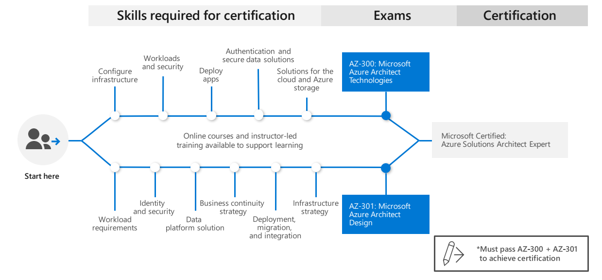

#  | Exam AZ-300: Microsoft Azure Architect Technologies (deprecating)

|                                   |                                                        |
| --------------------------------- | :----------------------------------------------------- |
|**Official Link:**                 | [Overview AZ-300](https://docs.microsoft.com/en-us/learn/certifications/exams/AZ-300)                                                    |
|**Part of the requirements for:**  | [Microsoft Certified: Azure Solutions Architect Expert](https://docs.microsoft.com/en-us/learn/certifications/azure-solutions-architect)          |
| **Outline:**            | [Outline AZ-300](https://query.prod.cms.rt.microsoft.com/cms/api/am/binary/RE3VzwB)                                                      |
|**Length:**                        | 3 hours                                                                                                                                  |
|**Registration fee:**              | $165 (plus tax where applicable).  Other discounts possible.                                                                             |
|**Exam format:**                   | Various question types, taken in person at a test center or from home.                                                                   |
|**Difficulty:**                    | N/A                                                                                                                                      |
|**Official Practice Test:**        | [Practice Test AZ-300](https://us.mindhub.com/p/MU-AZ-300)                                                                               |
|**Certification Learning Path:**   | [Learning path for Azure Solutions Architect](https://query.prod.cms.rt.microsoft.com/cms/api/am/binary/RWtVsd)                             |

------------------------------------------------------------------------------------------------
   

## **Contents**
- [Posts & Guides](#posts-&-guides)
- [Labs](#labs)
- [Books](#books)
- [Videos / Sessions](#videos-/-sessions)
- [Online Trainings](#online-trainings)
- [Practice Exams / Tests](#practice-exams-/-tests)

------------------------------------------------------------------------------------------------
   

## **Posts & Guides**
| Published | Title/Link                                                     | Author             | Checked |
| :-------: | :------------------------------------------------------------- | :----------------- |:-------:|
| Mar 2020  | [Azure-AZ-300-Study-Guide](https://github.com/AzureMentor/Azure-AZ-300-Study-Guide)    | [Azure Mentor](https://azurementor.wordpress.com/) | |
| Apr 2019  | [My mantra to clear AZ-300 Azure Architect Technologies certification](https://www.handsonarchitect.com/2019/04/my-mantra-to-clear-az-300-azure.html) | Nilesh Gule   |  |
| Dec 2019  | [8 tips to prepare for AZ-300 exam](https://medium.com/@piotrzan/8-tips-to-prepare-for-az-300-exam-cadff5532394)        | Piotr                                              | |
| Jan 2020  | [GitHub repository with plenty of references - az-300-prep-kit](https://github.com/Piotr1215/az-300-prep-kit)                                         | Piotr                                              | |

------------------------------------------------------------------------------------------------
   

## **Labs**
|                                           Title/Link                                           | Description                         | Author | Checked |
| :--------------------------------------------------------------------------------------------: | :---------------------------------- | :----- |:-------:|
| [AZ-300 Labs](https://github.com/MicrosoftLearning/AZ-300-MicrosoftAzureArchitectTechnologies) | Official Microsoft AZ-300 Labs Repo | MSFT   | |

## **Books**
| Published | Title/Link                                          | Author        | Checked |
| :-------: | :-------------------------------------------------- | --------------|:-------:|
| Nov 2019  | [Exam Ref AZ-300 Microsoft Azure Architect Technologies](https://www.amazon.com/AZ-300-Microsoft-Azure-Architect-Technologies/dp/0135802547/) | Mike Pfeiffer, Derek Schauland, Nicole Stevens, Timothy L. Warner | |

------------------------------------------------------------------------------------------------
   

## **Videos / Sessions**
| Published | Title/Link                                                                                                | Author      | Checked |
| :-------: | :-------------------------------------------------------------------------------------------------------- | ----------- |:-------:|
| Jan 2020  | [EXAM PREP: AZ-300 - Microsoft Azure Architect Technologies](https://www.youtube.com/watch?v=cBlDAnXx1Y4) | Tiago Costa | |

------------------------------------------------------------------------------------------------
   

## **Online Trainings**
|     Site      | Title/Link                                                                             | Instructor  | Checked |
| :-----------: | :------------------------------------------------------------------------------------- | :---------- |:-------:|
|  Pluralsight  | [Microsoft Azure Architect Technologies (AZ-300)](https://www.pluralsight.com/paths/microsoft-azure-architect-technologies-az-300)                      | Various     | |
|     Udemy     | [AZ-300 Azure Architecture Technologies Exam Prep 2020](https://www.udemy.com/course/70534-azure/)                                                      | Scott Duffy | |
| Linux Academy | [Microsoft Azure Architect Technologies – Exam AZ-300](https://linuxacademy.com/course/az-300-exam-preparation-microsoft-azure-architect-technologies/) | James Lee   | |
|  Acloud guru  | [AZ-300 Microsoft Azure Architect Technologies 2020](https://acloud.guru/learn/az-300-architect-technologies)                                           | Nick Colyer | |

------------------------------------------------------------------------------------------------
   

## **Practice Exams / Tests**
|Title/Link                      | Description                                                      | Author           |   Checked   |
|------------------------------- | ---------------------------------------------------------------- | ---------------- |:-----------:|
|[Excel Exam Assessment](https://github.com/Build5Nines/exam-assessments/blob/master/Assessments/Exam-Msft-AZ-300-Self-Assessment-Build5Nines.xlsx?raw=1) | Free Azure Certification Exam Self Assessment from Build5Nines.com  - [Guide here](https://build5nines.com/free-oss-exam-self-assessment-tool/) | Chris Pietschmann | |
|[Microsoft AZ-300 Exam](https://www.examtopics.com/exams/microsoft/az-300/)   | 100 free questions to challenge you   | ExamTopics        | |

------------------------------------------------------------------------------------------------
   

___
 <a href="#top" title="Back to the top.">↑Top</a>
