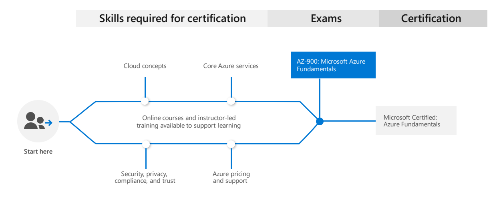

 [Home Azure Cloud][1]

[1]: https://github.com/weder96/azure-cloud-learning

# Exam AZ-900: Microsoft Azure Fundamentals

## **Contents**
1. [Posts & Guides](#posts-&-guides)
2. [Labs](#labs)
3. [Books](#books)
4. [Videos / Sessions](#videos-/-sessions)
5. [Online Trainings](#online-trainings)
6. [Practice Exams / Tests](#practice-exams-/-tests)

*******************************************************************************************************

|  |  |   
|---------------------------------- | --------------------------------------------------------------------- |
|**Official Link:**                 | [Overview AZ-900](https://docs.microsoft.com/en-us/learn/certifications/exams/AZ-900)                        |
|**Part of the requirements for:**  | [Microsoft Certified Azure Fundamentals](https://docs.microsoft.com/en-us/learn/certifications/azure-fundamentals) |
|**Outline:**                       | [Outline AZ-900](https://query.prod.cms.rt.microsoft.com/cms/api/am/binary/RE3VwUY)                                |
|**Length:**                        | 90 minutes                                                                                                         |
|**Registration fee:**              | $60 (plus tax where applicable).  Other discounts possible (Brazil).                                                        |
|**Exam format:**                   | Various question types, taken in person at a test center or from home.                                             |
|**Difficulty:**                    | N/A                                                                                                                |
|**Official Practice Test:**        | [Practice Test AZ-900](https://us.mindhub.com/p/MU-AZ-900)                                                         |
| **Certification Learning Path:**  | [Azure Fundamentals Learning path](https://query.prod.cms.rt.microsoft.com/cms/api/am/binary/RE38YZj)              |

------------------------------------------------------------------------------------------------ 
   

## **Posts & Guides**
| Published | Title/Link         | Author            | Checked |
| --------- | ------------------ |------------------ |:---------:|
| Feb 2020  | [Azure-AZ-900-Study-Guide](https://github.com/AzureMentor/Azure-AZ-900-Study-Guide) | [Azure Mentor](https://azurementor.wordpress.com/) |  |
| Apr 2019  | [AZ-900 Study Guide: Microsoft Azure Fundamentals](https://vladtalkstech.com/az-900-study-guide-microsoft-azure-fundamentals)                                        | Vlad Catrinescu    |  |
| Aug 2019  | [Azure AZ-900 Exam Preparation Guide: How to pass in 3 days](https://medium.com/weareservian/azure-az-900-exam-preparation-guide-how-to-pass-in-3-days-dabf5534507a) | Perth Ngarmtrakulchol     | |

--------------------------------------------------------------------------------------------------------
   

## **Labs**
| Title/Link               | Description                        | Author | Checked |
| ------------------------ | ---------------------------------- | :----- | :--------:|
|[AZ-900 Labs](https://github.com/MicrosoftLearning/AZ-900T0x-MicrosoftAzureFundamentals) | Official Microsoft AZ-900 Labs Repo | MSFT   |  |
|[AZ-900 Labs - Youtube](https://www.youtube.com/watch?v=MEr2nK5hDME&list=PL0tdq6BH7heAdnNFvexwuVyd8macfcwX4&index=1) | Labs  | Cloud Security Training & Consulting |  |

--------------------------------------------------------------------------------------------------------
   

## **Books**
| Published | Title/Link      | Author       |Checked |
| :-------: | --------------- | :----------- | :------: |
| Jul 2019  | [Exam Ref AZ-900 Microsoft Azure Fundamentals](https://www.amazon.com/Exam-AZ-900-Microsoft-Azure-Fundamentals/dp/0135732182/) | Jim Cheshire | |

--------------------------------------------------------------------------------------------------------
   

## **Videos / Sessions**
| Published | Title/Link       | Author         | Checked   | Idiom   |
| :-------: | ---------------- | :------------- | :--------:|:--------:|
| Apr 2023  | [AZ-900EP 1/5 AZ900 Treinamento Oficial Microsoft Azure Fundamentals](https://www.youtube.com/watch?v=4ub1uGKQK6U&list=PLz3hnOImntANgM1EyWSGkY4v-7dhWURWt) | [CanaldaCloud](https://www.youtube.com/@CanaldaCloud) |  | Portuguese |
| Feb 2020  | [Exam AZ-900 Microsoft Azure Fundamentals Study Guide: Episode 1 of 63: Overview](https://www.youtube.com/watch?v=HfZ1kgHlrfg) | Tim Warner       | | English |
| Jan 2020  | [EXAM PREP: AZ-900 - Microsoft Azure Fundamentals - BRK1047](https://www.youtube.com/watch?v=kl0any3WFb0)                      | Tim Warner       | | English |
| Sep 2019  | [Azure Fundamentals Certification (AZ-900) - Cloud Skills](https://www.youtube.com/watch?v=eYpNnEHUFVI)                        | Tim Warner       | | English |
| Dec 2019  | [Microsoft Azure Fundamentals - AZ900 Exam Preparation - Introductory Course](https://www.youtube.com/watch?v=dKKZWp-_-c8)     | TestPrepTraining | | English |

--------------------------------------------------------------------------------------------------------
   

## **Online Trainings**
|     Site      | Title/Link      | Instructor      | Checked |
| --------------|-----------------| :-------------- | :--------:|
|     MSFT      | [Azure Fundamentals](https://docs.microsoft.com/en-us/learn/paths/azure-fundamentals/)                                                                     | MSFT            | |
|     Udemy     | [AZ-900: Microsoft Azure Fundamentals Exam Prep - 2020 Edition](https://www.udemy.com/course/az900-azure/)                                                 | Scott Duffy     | |
| Cloud Academy | [AZ-900 Exam Preparation: Microsoft Azure Fundamentals](https://cloudacademy.com/learning-paths/az-900-exam-preparation-microsoft-azure-fundamentals-524/) | Guy Hummel      | |
|  Pluralsight  | [Microsoft Azure Fundamentals](https://www.pluralsight.com/courses/azure-fundamentals)                                                                     | Matt Milner     | |
|     Udemy     | [AZ-900 Azure Exam Prep: Understanding Core Azure Services](https://www.udemy.com/course/az-900-azure-exam-prep-understanding-core-azure-services/)        | Thomas Mitchell | |
|     Udemy     | [AZ-900 Azure Exam Prep: Security Privacy Compliance & Trust](https://www.udemy.com/course/az-900-azure-exam-prep-security-privacy-compliance-trust/)      | Thomas Mitchell | |
| Linux Academy | [Microsoft Azure Fundamentals – AZ-900 Exam Prep](https://linuxacademy.com/course/microsoft-azure-fundamentals-az-900-exam-prep/)                          | Jason Calton    | |

--------------------------------------------------------------------------------------------------------
   

## Practice Exams / Tests

| Title/Link                           |Description         | Author            | Checked |
|--------------------------------------|------------------- | :---------------- | :--------:|
| [Excel Exam Assessment](https://github.com/Build5Nines/exam-assessments/blob/master/Assessments/Exam-Msft-AZ-900-Self-Assessment-Build5Nines.xlsx?raw=1) | Free Azure Certification Exam Self Assessment from Build5Nines.com  - [Guide here](https://build5nines.com/free-oss-exam-self-assessment-tool/) | Chris Pietschmann | |
|[Microsoft AZ-900 Exam](https://www.examtopics.com/exams/microsoft/az-900/)    | 100 free questions to challenge you  | ExamTopics        | |

--------------------------------------------------------------------------------------------------------

 <a href="#top" title="Back to the top.">↑Top</a>
