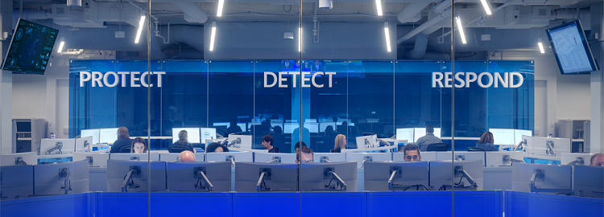

#  | Security
This section is all about Azure Security and Compliance. The resources will also contain guides and recommendations on how to set up the environment, but you will also see a lot of resources sharing information to provide a better understanding in general Security and Compliance topics.

## Contents
- [Landing Pages](#landing-pages)
- [Common Resources](#common-resources)
- [Videos / Sessions](#videos-/-sessions)
- [Templates](#templates)
- [Repos](#repos)
- [Blog](#blog)
- [Trends](#trends)

--------------------------------------------------------------------------------
   

## Landing Pages
|Title/Link| Description  | Author | Checked |
| ---------| ------------ | ------ |:-------:|
|[Microsoft Security Community](https://aka.ms/SecurityCommunity) | Webinars, Videos, Email List, Private Previews, Forums and much more | MSFT   ||

--------------------------------------------------------------------------------
   

## Common Resources
| Title/Link  | Description| Author | Checked|
| ----------- | ---------- | ------ |:------:|
|[Microsoft Cloud Identity for Enterprise Architects](https://go.microsoft.com/fwlink/p/?LinkId=524586) | What IT architects need to know about designing identity for organizations using Microsoft cloud services and platforms. | MSFT   ||
|[Microsoft Cloud Security for Enterprise Architects](https://go.microsoft.com/fwlink/p/?linkid=842070) | What IT architects need to know about security in Microsoft cloud services and platforms.    | MSFT   ||
|[Microsoft Cloud Networking for Enterprise Architects](https://docs.microsoft.com/en-us/office365/enterprise/Media/Network-Poster/MSFT_cloud_architecture_networking.pdf)| What IT architects need to know about networking for Microsoft cloud services and platforms. | MSFT   ||
| [Common Attacks and Microsoft Capabilities that protect your Organization](https://download.microsoft.com/download/F/A/C/FACFC1E9-FA35-4DF1-943C-8D4237B4275B/MSFT_Cloud_architecture_security_commonattacks.pdf) | Learn about the most common cyber attacks and how Microsoft can help your organization at every stage of an attack.      | MSFT   ||
| [Deploy a Modern and Secure Desktop with Microsoft](https://download.microsoft.com/download/4/E/9/4E90E227-770A-41D1-99FE-925A64D81A55/MSFT_modern_secure_desktop.pdf)  | What IT architects need to know about deploying and managing updates for Office 365 ProPlus on Windows 10.               | MSFT   ||

--------------------------------------------------------------------------------
   

## **Videos / Sessions**
| Published | Title/Link | Author | Checked|
| :-------: | ---------- | ------ |:-------:|
| Mar 2020  | [Think You're Compromised? What Do We Do Next?](https://www.youtube.com/watch?v=DuIXbz30mqk) | Black Hills Information Security ||
| Mar 2020  | [Enterprise Recon For Purple Teams](https://www.youtube.com/watch?v=5c4KHB8dZMw)             | Black Hills Information Security ||

--------------------------------------------------------------------------------
   

## **Templates**
|     Title/Link      | Description              | Author |Checked|
| ------------------- | ------------------------ | :----- |:------:|
|        [Azure Policies Repo](https://github.com/Azure/azure-policy)         | Official Azure Policy repo including various samples | MSFT   ||
| [Azure Policies Community Repo ](https://github.com/Azure/Community-Policy) | Azure Policies provided by the Community             | MSFT   ||

--------------------------------------------------------------------------------
   

## **Repos**
| Title/Link | Description | Author |Checked|
| :--------: | :---------- | :----- |:------:|

--------------------------------------------------------------------------------
   

## **Blogs**
|            Title/Link             | Description        | Author |Checked|
| --------------------------------- | ------------------ | :----- |:------:|
|[Blog Azure Government - Security & Compliance](https://devblogs.microsoft.com/azuregov/) | Fantastic blog with plenty security references | MSFT   ||
|[Microsoft Security Community](https://aka.ms/SecurityCommunity)              | Tech events around the world                   | MSFT   ||

--------------------------------------------------------------------------------
   

## Trends
|   Title/Link    | Description                  | Author  | Checked |
| --------------- | ---------------------------- | ------- |:-------:|
| [M-Trends 2020](https://content.fireeye.com/m-trends/rpt-m-trends-2020) | Fireeye Security Trends 2020, plus the references to the ones of the previous years. | Fireeye ||

--------------------------------------------------------------------------------
   

 <a href="#top" title="Back to the top.">↑Top</a>